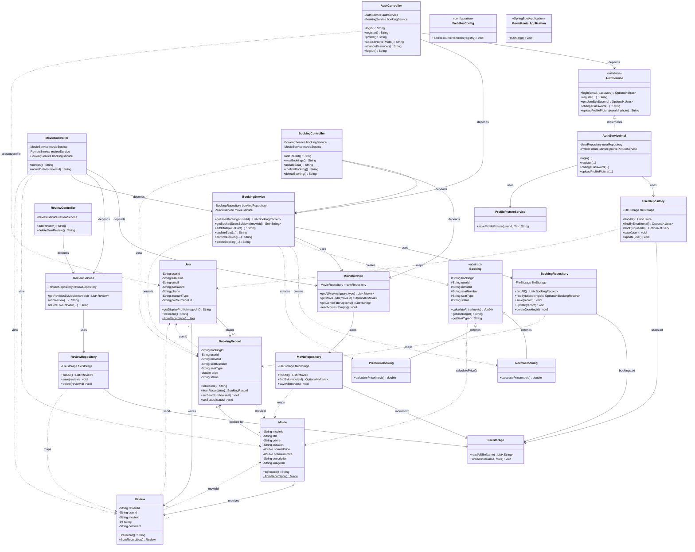
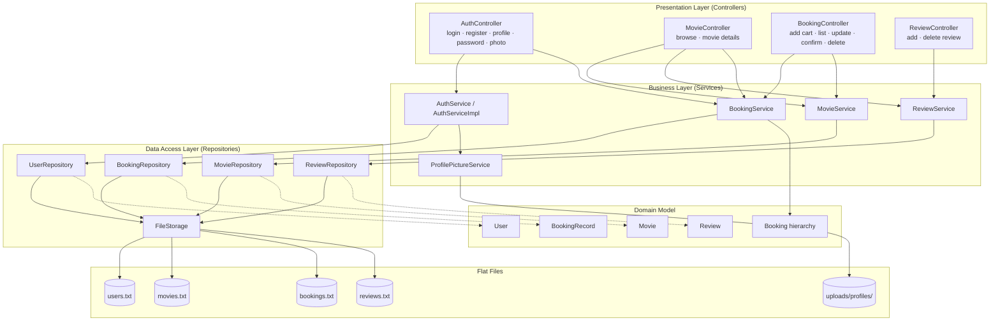

# Movie Rental and Review Platform — Full Class Diagram

**Project:** Cinevora (Spring Boot 3.3 · JSP · File-based persistence)  
**Scope:** All application classes and **main** operations for authentication, movies, seat booking, and reviews.

---

## 1. UML Legend (Relationships)

| Symbol / Notation | Meaning | Used in this project |
|-------------------|---------|----------------------|
| `△` (empty triangle) | **Generalization / Inheritance** | `NormalBooking`, `PremiumBooking` extend `Booking` |
| `△` (dashed) | **Interface realization** | `AuthServiceImpl` implements `AuthService` |
| `──>` solid arrow | **Association / uses** | Controller → Service, Service → Repository |
| `..>` dashed arrow | **Dependency** | `Booking.calculatePrice(Movie)`, `FileStorage` I/O |
| `1` | Exactly one | One `User` per booking row (by `userId`) |
| `0..1` | Zero or one | Optional `Movie` lookup when booking |
| `1..*` / `*` | One-to-many / many | User has many bookings and reviews |
| `*..*` | **Many-to-many** | Users ↔ Movies via `Review` (association entity) |

**Persistence note:** `BookingRecord`, `Review`, `User`, and `Movie` are linked by **ID fields** (`userId`, `movieId`) in flat files—not JPA entities. Multiplicities describe the **domain model**, not database foreign keys.

---

## 2. Complete Class Diagram (All Classes & Main Relationships)

Copy the diagram below into [Mermaid Live Editor](https://mermaid.live) or any Markdown viewer that supports Mermaid for export to PNG/SVG.

---

## 3. Domain Model Only (7 Main Classes — Full Diagram)

**See also:** [`MODEL_CLASS_DIAGRAM.md`](MODEL_CLASS_DIAGRAM.md) — complete attributes, methods, inheritance, **1 : 0..***, **\* : \***, and dependency chart for:

`User` · `Movie` · `Booking` · `NormalBooking` · `PremiumBooking` · `BookingRecord` · `Review`

**Cardinality summary**

| Relationship | Type | Multiplicity |
|--------------|------|--------------|
| User → BookingRecord | Association | **1 : 0..*** |
| Movie → BookingRecord | Association | **1 : 0..*** |
| User → Review | Association | **1 : 0..*** |
| Movie → Review | Association | **1 : 0..*** |
| User ↔ Movie | **Many-to-many** | ***** : ***** (via `Review`) |
| NormalBooking / PremiumBooking → Booking | **Inheritance** | IS-A |
| Booking → Movie | Dependency | `calculatePrice(Movie)` |
| Booking → BookingRecord | Dependency | persisted after pricing |

---

## 4. Layered Architecture (Main Functions by Module)

---

## 5. Main Functions per Class (Quick Reference)

### 5.1 Authentication & profile

| Class | Main functions |
|-------|----------------|
| **AuthController** | `login`, `register`, `profile`, `uploadProfilePhoto`, `changePassword`, `logout` |
| **AuthService** | `login`, `register`, `getUserById`, `changePassword`, `uploadProfilePicture` |
| **AuthServiceImpl** | Implements auth; delegates photo save to **ProfilePictureService** |
| **ProfilePictureService** | `saveProfilePicture` → writes `uploads/profiles/{userId}.ext` |
| **UserRepository** | `findByEmail`, `findById`, `save`, `update` |
| **User** | Registration data, profile image URL, `toRecord` / `fromRecord` |

### 5.2 Movies & browsing

| Class | Main functions |
|-------|----------------|
| **MovieController** | `movies` (search + genre filter), `movieDetails` (seats + reviews) |
| **MovieService** | `getAllMovies`, `getMovieById`, `getGenreFilterOptions`, seed data |
| **MovieRepository** | `findAll`, `findById`, `saveAll` |
| **Movie** | Catalog entity (title, genre, prices, poster) |

### 5.3 Booking (seat rental)

| Class | Main functions |
|-------|----------------|
| **BookingController** | `addToCart`, `viewBookings`, `updateSeat`, `confirmBooking`, `deleteBooking` |
| **BookingService** | Cart CRUD, seat conflict checks, price via **Booking** polymorphism |
| **Booking** *(abstract)* | `calculatePrice(Movie)` — strategy pattern |
| **NormalBooking** | Price = `movie.normalPrice` |
| **PremiumBooking** | Price = `movie.premiumPrice` |
| **BookingRecord** | Persisted booking row (PENDING / CONFIRMED) |
| **BookingRepository** | `save`, `update`, `delete`, `findById` |

### 5.4 Reviews

| Class | Main functions |
|-------|----------------|
| **ReviewController** | `addReview`, `deleteOwnReview` |
| **ReviewService** | `getReviewsByMovie`, `addReview`, `deleteOwnReview` |
| **ReviewRepository** | `findAll`, `save`, `delete` |
| **Review** | Links `userId` + `movieId` + rating + comment |

### 5.5 Infrastructure

| Class | Role |
|-------|------|
| **FileStorage** | Read/write pipe-delimited lines under `src/main/resources/data/` |
| **WebMvcConfig** | Serves `/posters/profiles/**` from disk |
| **MovieRentalApplication** | Spring Boot entry point |

---

## 6. Design Patterns Used

| Pattern | Where | Purpose |
|---------|--------|---------|
| **MVC** | Controllers → Services → JSP views | Separation of concerns |
| **Repository** | `*Repository` + `FileStorage` | Hide file persistence |
| **Strategy / Polymorphism** | `NormalBooking` / `PremiumBooking` | Different seat pricing |
| **DTO / persistence model** | `Booking` (logic) vs `BookingRecord` (storage) | Calculate in memory, store flat record |
| **Dependency injection** | Spring `@Service`, `@Repository`, constructors | Loose coupling |
| **Association entity** | `Review` | Many users review many movies |

---

## 7. Class Inventory (24 classes)

| Package | Classes |
|---------|---------|
| `com.movierental` | `MovieRentalApplication` |
| `com.movierental.config` | `WebMvcConfig` |
| `com.movierental.controller` | `AuthController`, `MovieController`, `BookingController`, `ReviewController` |
| `com.movierental.service` | `AuthService`, `AuthServiceImpl`, `MovieService`, `BookingService`, `ReviewService`, `ProfilePictureService` |
| `com.movierental.repository` | `FileStorage`, `UserRepository`, `MovieRepository`, `BookingRepository`, `ReviewRepository` |
| `com.movierental.model` | `User`, `Movie`, `Booking`, `NormalBooking`, `PremiumBooking`, `BookingRecord`, `Review` |

---

## 8. Exporting for Your Report

1. Open [https://mermaid.live](https://mermaid.live).
2. Paste **Section 2** (full application) or **`MODEL_CLASS_DIAGRAM.md` Section 2** (domain models only).
3. Export as **PNG** or **SVG** for Word/PDF.
4. For PlantUML tools, use the same structure: packages `model`, `service`, `repository`, `controller` with the relationships above.

---

*Generated from source code in `src/main/java/com/movierental/` — Movie Rental and Review Platform (Cinevora).*
