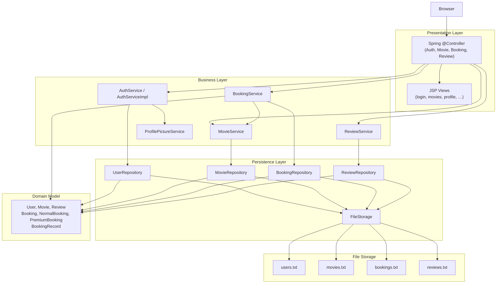
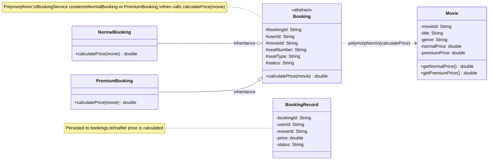
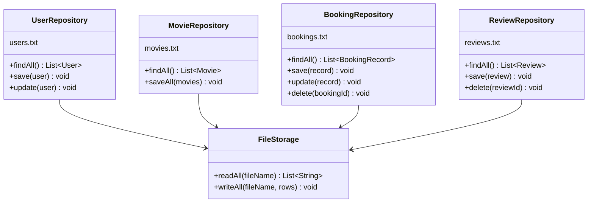
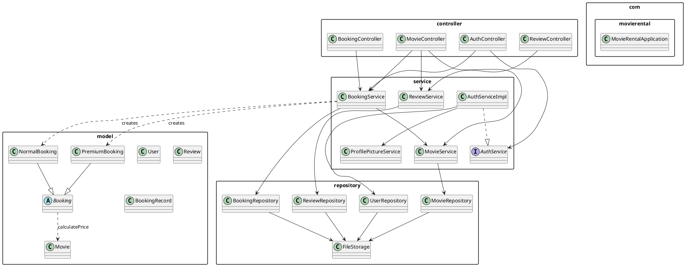

# Cinevora — Movie Rental and Review Platform  
## Full Class Diagrams (SE1020)

---

## 1. System architecture (layers)

---

## 2. Complete class diagram (all Java classes)

```mermaid
classDiagram
    direction TB

    %% ========== Application ==========
    class MovieRentalApplication {
        +main(args: String[]) void
        +configure(builder: SpringApplicationBuilder) SpringApplicationBuilder
    }
    class SpringBootServletInitializer {
        <<Spring Framework>>
    }
    MovieRentalApplication --|> SpringBootServletInitializer

    %% ========== Controllers ==========
    class AuthController {
        -authService: AuthService
        -bookingService: BookingService
        +home(session: HttpSession) String
        +loginPage(session: HttpSession) String
        +login(email, password, model, session) String
        +registerPage(session) String
        +register(fullName, email, password, phone, model) String
        +profile(model, session) String
        +uploadProfilePhoto(photo, redirectAttributes, session) String
        +changePassword(old, new, confirm, redirectAttributes, session) String
        +logout(session) String
    }

    class MovieController {
        -movieService: MovieService
        -reviewService: ReviewService
        -bookingService: BookingService
        +movies(q, type, session, model) String
        +movieDetails(movieId, session, model) String
    }

    class BookingController {
        -bookingService: BookingService
        -movieService: MovieService
        +addToCart(movieId, seatSelections, session, redirectAttributes) String
        +viewBookings(session, model) String
        +updateSeat(bookingId, seatNumber, session, redirectAttributes) String
        +deleteBooking(bookingId, session, redirectAttributes) String
        +confirmBooking(bookingId, session, redirectAttributes) String
    }

    class ReviewController {
        -reviewService: ReviewService
        +addReview(movieId, rating, comment, session, redirectAttributes) String
        +deleteOwnReview(reviewId, movieId, session, redirectAttributes) String
    }

    %% ========== Services ==========
    class AuthService {
        <<interface>>
        +login(email, password) Optional~User~
        +register(fullName, email, password, phone) String
        +getUserById(userId) Optional~User~
        +changePassword(userId, old, new, confirm) String
        +uploadProfilePicture(userId, photo) String
    }

    class AuthServiceImpl {
        -userRepository: UserRepository
        -profilePictureService: ProfilePictureService
        +login(email, password) Optional~User~
        +register(...) String
        +getUserById(userId) Optional~User~
        +changePassword(...) String
        +uploadProfilePicture(userId, photo) String
    }

    class MovieService {
        -movieRepository: MovieRepository
        +getGenreFilterOptions() List~String~
        +getAllMovies(query, type) List~Movie~
        +getMovieById(movieId) Optional~Movie~
        -seedMoviesIfEmpty() void
    }

    class BookingService {
        -bookingRepository: BookingRepository
        -movieService: MovieService
        +getUserBookings(userId) List~BookingRecord~
        +getBookedSeatsByMovie(movieId) Set~String~
        +addToCart(...) String
        +addMultipleToCart(...) String
        +updateSeat(...) String
        +deleteBooking(...) String
        +confirmBooking(...) String
    }

    class ReviewService {
        -reviewRepository: ReviewRepository
        +getReviewsByMovie(movieId) List~Review~
        +addReview(userId, movieId, rating, comment) String
        +deleteOwnReview(userId, reviewId) String
    }

    class ProfilePictureService {
        -UPLOAD_DIR: Path
        +saveProfilePicture(userId, file) String
        -deleteExistingPictures(userId) void
    }

    AuthServiceImpl ..|> AuthService

    %% ========== Repositories ==========
    class FileStorage {
        -BASE_PATH: String
        +readAll(fileName) List~String~
        +writeAll(fileName, rows) void
        -resolve(fileName) Path
        -ensureExists(path) void
    }

    class UserRepository {
        -FILE: String
        -fileStorage: FileStorage
        +findAll() List~User~
        +findByEmail(email) Optional~User~
        +findById(userId) Optional~User~
        +save(user) void
        +update(updatedUser) void
        -persist(users) void
    }

    class MovieRepository {
        -FILE: String
        -fileStorage: FileStorage
        +findAll() List~Movie~
        +findById(movieId) Optional~Movie~
        +saveAll(movies) void
    }

    class BookingRepository {
        -FILE: String
        -fileStorage: FileStorage
        +findAll() List~BookingRecord~
        +findById(bookingId) Optional~BookingRecord~
        +save(record) void
        +update(record) void
        +delete(bookingId) void
        -persist(records) void
    }

    class ReviewRepository {
        -FILE: String
        -fileStorage: FileStorage
        +findAll() List~Review~
        +save(review) void
        +delete(reviewId) void
        -persist(reviews) void
    }

    %% ========== Domain models ==========
    class User {
        +DEFAULT_PROFILE_IMAGE: String
        -userId: String
        -fullName: String
        -email: String
        -password: String
        -phone: String
        -accountType: String
        -profileImageUrl: String
        +toRecord() String
        +fromRecord(record)$ User
        +getDisplayProfileImageUrl() String
    }

    class Movie {
        -movieId: String
        -title: String
        -genre: String
        -duration: String
        -normalPrice: double
        -premiumPrice: double
        -description: String
        -imageUrl: String
        +toRecord() String
        +fromRecord(record)$ Movie
    }

    class Review {
        -reviewId: String
        -userId: String
        -movieId: String
        -rating: int
        -comment: String
        +toRecord() String
        +fromRecord(row)$ Review
    }

    class Booking {
        <<abstract>>
        #bookingId: String
        #userId: String
        #movieId: String
        #seatNumber: String
        #seatType: String
        #status: String
        +calculatePrice(movie)* double
    }

    class NormalBooking {
        +calculatePrice(movie) double
    }

    class PremiumBooking {
        +calculatePrice(movie) double
    }

    class BookingRecord {
        -bookingId: String
        -userId: String
        -movieId: String
        -seatNumber: String
        -seatType: String
        -price: double
        -status: String
        +toRecord() String
        +fromRecord(row)$ BookingRecord
    }

    NormalBooking --|> Booking
    PremiumBooking --|> Booking
    Booking ..> Movie : uses for pricing

    %% ========== Controller dependencies ==========
    AuthController --> AuthService
    AuthController --> BookingService
    MovieController --> MovieService
    MovieController --> ReviewService
    MovieController --> BookingService
    BookingController --> BookingService
    BookingController --> MovieService
    ReviewController --> ReviewService

    %% ========== Service dependencies ==========
    AuthServiceImpl --> UserRepository
    AuthServiceImpl --> ProfilePictureService
    MovieService --> MovieRepository
    BookingService --> BookingRepository
    BookingService --> MovieService
    ReviewService --> ReviewRepository
    BookingService ..> NormalBooking : creates
    BookingService ..> PremiumBooking : creates
    BookingService ..> BookingRecord : persists

    %% ========== Repository dependencies ==========
    UserRepository --> FileStorage
    MovieRepository --> FileStorage
    BookingRepository --> FileStorage
    ReviewRepository --> FileStorage

    UserRepository ..> User : maps
    MovieRepository ..> Movie : maps
    BookingRepository ..> BookingRecord : maps
    ReviewRepository ..> Review : maps

    %% ========== Logical domain links (by ID) ==========
    User "1" --> "*" Review : writes
    User "1" --> "*" BookingRecord : owns
    Movie "1" --> "*" Review : has
    Movie "1" --> "*" BookingRecord : booked for
```

---

## 3. Domain model diagram (OOP focus)

Shows **encapsulation**, **inheritance**, and **polymorphism** required for SE1020.

---

## 4. File persistence diagram

**Record format (pipe-separated):**

| File | Format |
|------|--------|
| `users.txt` | `userId\|fullName\|email\|password\|phone\|accountType\|profileImageUrl` |
| `movies.txt` | `movieId\|title\|genre\|duration\|normalPrice\|premiumPrice\|description\|imageUrl` |
| `bookings.txt` | `bookingId\|userId\|movieId\|seatNumber\|seatType\|price\|status` |
| `reviews.txt` | `reviewId\|userId\|movieId\|rating\|comment` |

---

## 5. Controller → Service → CRUD mapping

| Feature | Controller | Service | Repository | File | CRUD |
|---------|------------|---------|------------|------|------|
| Register | `AuthController.register` | `AuthService.register` | `UserRepository.save` | users.txt | **Create** |
| Login / Profile | `AuthController` | `AuthService.login`, `getUserById` | `UserRepository.find*` | users.txt | **Read** |
| Change password / Photo | `AuthController` | `AuthService` | `UserRepository.update` | users.txt | **Update** |
| Browse movies | `MovieController.movies` | `MovieService.getAllMovies` | `MovieRepository.findAll` | movies.txt | **Read** |
| Movie details | `MovieController.movieDetails` | `MovieService`, `ReviewService`, `BookingService` | multiple | multiple | **Read** |
| Add booking | `BookingController.addToCart` | `BookingService.addMultipleToCart` | `BookingRepository.save` | bookings.txt | **Create** |
| My bookings | `BookingController.viewBookings` | `BookingService.getUserBookings` | `BookingRepository.findAll` | bookings.txt | **Read** |
| Update seat | `BookingController.updateSeat` | `BookingService.updateSeat` | `BookingRepository.update` | bookings.txt | **Update** |
| Delete booking | `BookingController.deleteBooking` | `BookingService.deleteBooking` | `BookingRepository.delete` | bookings.txt | **Delete** |
| Confirm booking | `BookingController.confirmBooking` | `BookingService.confirmBooking` | `BookingRepository.update` | bookings.txt | **Update** |
| Add review | `ReviewController.addReview` | `ReviewService.addReview` | `ReviewRepository.save` | reviews.txt | **Create** |
| Delete review | `ReviewController.deleteOwnReview` | `ReviewService.deleteOwnReview` | `ReviewRepository.delete` | reviews.txt | **Delete** |

---

## 6. PlantUML (for draw.io / PlantUML tools)

Copy into [PlantUML Online](https://www.plantuml.com/plantuml) or IntelliJ PlantUML plugin.

---

## 7. Class summary table

| Package | Class | Role |
|---------|-------|------|
| `com.movierental` | `MovieRentalApplication` | Spring Boot entry point |
| `controller` | `AuthController` | Login, register, profile, logout |
| `controller` | `MovieController` | Movie list & details |
| `controller` | `BookingController` | Seat booking CRUD |
| `controller` | `ReviewController` | Add/delete reviews |
| `service` | `AuthService` | Auth contract (interface) |
| `service` | `AuthServiceImpl` | Auth implementation |
| `service` | `MovieService` | Movie browse & seed data |
| `service` | `BookingService` | Booking logic + polymorphic pricing |
| `service` | `ReviewService` | Review logic |
| `service` | `ProfilePictureService` | Profile image file upload |
| `repository` | `FileStorage` | Read/write text files |
| `repository` | `UserRepository` | User CRUD on `users.txt` |
| `repository` | `MovieRepository` | Movie read/write on `movies.txt` |
| `repository` | `BookingRepository` | Booking CRUD on `bookings.txt` |
| `repository` | `ReviewRepository` | Review create/delete on `reviews.txt` |
| `model` | `User` | User entity |
| `model` | `Movie` | Movie entity |
| `model` | `Review` | Review entity |
| `model` | `Booking` | Abstract booking (polymorphism) |
| `model` | `NormalBooking` | Normal seat pricing |
| `model` | `PremiumBooking` | Premium seat pricing |
| `model` | `BookingRecord` | Persisted booking row |

**Total: 22 application classes** (+ Spring/JSP presentation layer)

---

*Generated for SE1020 — Movie Rental and Review Platform (Cinevora)*
