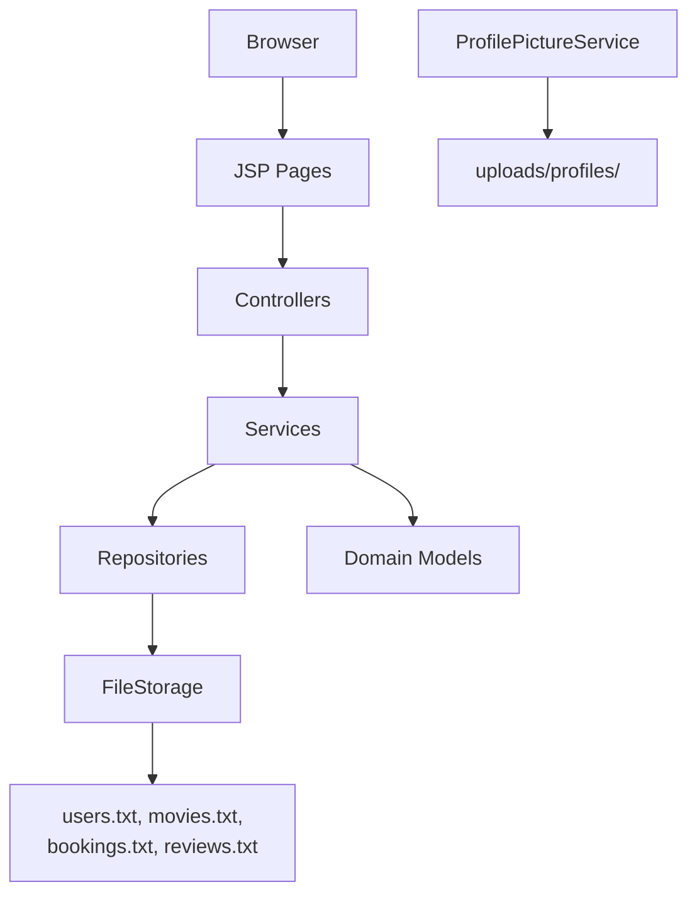
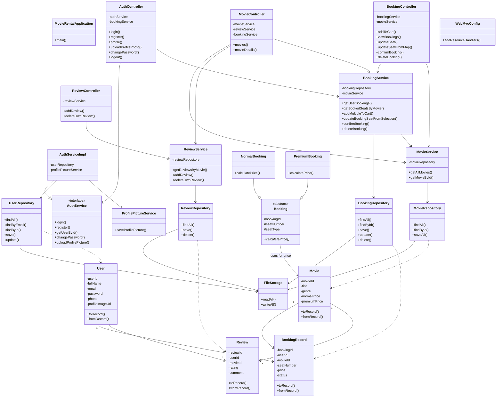
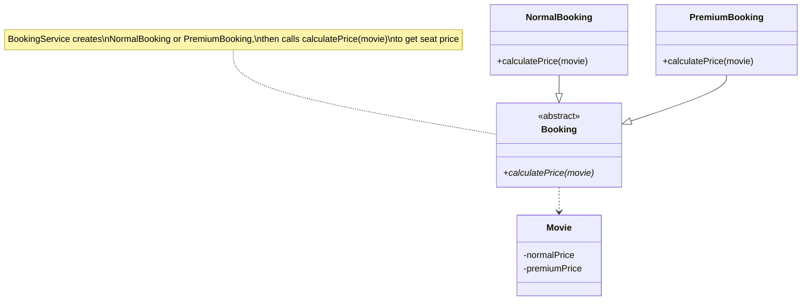

# Cinevora — Movie Rental and Review Platform  
## Class Diagrams (SE1020)

Simple diagrams for your report. Paste any block into [Mermaid Live](https://mermaid.live) to export as PNG/SVG.

---

## 1. System layers (overview)

---

## 2. Full class diagram (all classes)

Shows every class and main relationships. Methods are summarized to keep the chart readable.

---

## 3. OOP diagram (inheritance & polymorphism)

Required for SE1020 — shows **encapsulation** (private fields), **inheritance**, and **polymorphism**.

---

## 4. Data files

| File | What it stores |
|------|----------------|
| `users.txt` | Registered users |
| `movies.txt` | Movie catalogue |
| `bookings.txt` | Seat bookings |
| `reviews.txt` | Movie reviews |
| `uploads/profiles/` | Profile photos (images) |

All text files use **pipe-separated** values (`|`). Example booking row:  
`bookingId|userId|movieId|seatNumber|seatType|price|status`

---

## 5. Class list (23 classes)

| Package | Class | Role |
|---------|-------|------|
| root | `MovieRentalApplication` | Starts the app |
| `config` | `WebMvcConfig` | Serves profile images |
| `controller` | `AuthController` | Login, register, profile |
| `controller` | `MovieController` | Movie list & details |
| `controller` | `BookingController` | Bookings CRUD |
| `controller` | `ReviewController` | Reviews |
| `service` | `AuthService` | Auth interface |
| `service` | `AuthServiceImpl` | Auth logic |
| `service` | `MovieService` | Movie logic |
| `service` | `BookingService` | Booking logic |
| `service` | `ReviewService` | Review logic |
| `service` | `ProfilePictureService` | Upload profile photo |
| `repository` | `FileStorage` | Read/write files |
| `repository` | `UserRepository` | User data |
| `repository` | `MovieRepository` | Movie data |
| `repository` | `BookingRepository` | Booking data |
| `repository` | `ReviewRepository` | Review data |
| `model` | `User` | User entity |
| `model` | `Movie` | Movie entity |
| `model` | `Review` | Review entity |
| `model` | `Booking` | Abstract booking |
| `model` | `NormalBooking` | Normal seat price |
| `model` | `PremiumBooking` | Premium seat price |
| `model` | `BookingRecord` | Saved booking row |

---

*Cinevora — SE1020 Movie Rental and Review Platform*
