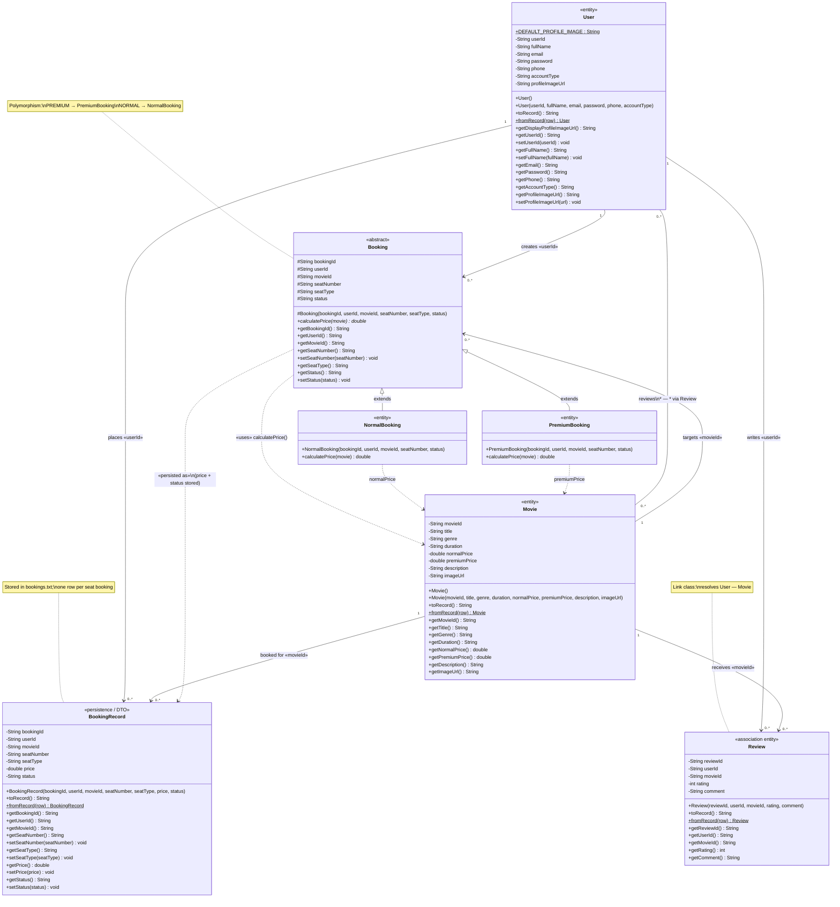

# Domain Model — Full Class Diagram (Main Models)

**Project:** Cinevora — Movie Rental and Review Platform  
**Package:** `com.movierental.model`  
**Classes:** `User`, `Movie`, `Booking`, `NormalBooking`, `PremiumBooking`, `BookingRecord`, `Review`

This diagram covers **only** the seven core domain classes and every main relationship between them (inheritance, association, dependency, and many-to-many via `Review`).

---

## 1. UML relationship legend

| Notation | Relationship | Example in this project |
|----------|--------------|-------------------------|
| `△` solid line, empty triangle | **Generalization (inheritance)** | `NormalBooking` IS-A `Booking` |
| `──` solid line + multiplicity | **Association** | `User` places many `BookingRecord` rows (linked by `userId`) |
| `..>` dashed arrow | **Dependency (uses)** | `calculatePrice(Movie)` at booking time |
| `1` | Exactly one | Each `Review` belongs to one `User` and one `Movie` |
| `0..*` | Zero or more | A `User` may have zero or many bookings |
| `*` | Many (zero or more) | Many users review many movies |
| `*..*` | **Many-to-many** | `User` ↔ `Movie` through `Review` (association / link class) |

**Note:** Classes store foreign keys (`userId`, `movieId`) in text files, not JPA. Multiplicities describe the **business domain**, not database FK constraints.

---

## 2. Complete class diagram (all classes & relationships)

Paste into [Mermaid Live Editor](https://mermaid.live) to export PNG/SVG for your report.



---

## 3. Relationship summary table

| From | To | UML type | Multiplicity | How it is implemented |
|------|-----|----------|--------------|------------------------|
| **NormalBooking** | **Booking** | Generalization (inheritance) | IS-A | `extends Booking` |
| **PremiumBooking** | **Booking** | Generalization (inheritance) | IS-A | `extends Booking` |
| **Booking** | **Movie** | Dependency | uses | `calculatePrice(Movie movie)` |
| **User** | **BookingRecord** | Association | **1 : 0..*** | `BookingRecord.userId` |
| **Movie** | **BookingRecord** | Association | **1 : 0..*** | `BookingRecord.movieId` |
| **User** | **Review** | Association | **1 : 0..*** | `Review.userId` |
| **Movie** | **Review** | Association | **1 : 0..*** | `Review.movieId` |
| **User** | **Movie** | **Many-to-many** | ***** : ***** | Via **Review** (each review links one user to one movie; many reviews = M:N) |
| **User** | **Booking** | Association (transient) | **1 : 0..*** | `Booking.userId` during cart flow |
| **Movie** | **Booking** | Association (transient) | **1 : 0..*** | `Booking.movieId` during cart flow |
| **Booking** | **BookingRecord** | Dependency | 1 → 1 per save | `BookingService` builds `Booking`, then saves `BookingRecord` with computed `price` |

---

## 4. ASCII overview (quick reference)

```
                    ┌─────────────────┐
                    │  Booking        │◄──────┐
                    │  (abstract)     │       │ inheritance
                    └────────┬────────┘       │
                             │                │
              ┌──────────────┼──────────────┐ │
              │              │              │ │
     ┌────────▼────────┐    │    ┌─────────▼─────────┐
     │  NormalBooking   │    │    │  PremiumBooking   │
     │  seatType=NORMAL │    │    │  seatType=PREMIUM │
     └────────┬─────────┘    │    └─────────┬─────────┘
              │              │              │
              └──────────────┼──────────────┘
                             │ depends on
                             ▼
                    ┌─────────────────┐
                    │     Movie       │
                    └────────┬────────┘
                             │
         ┌───────────────────┼───────────────────┐
         │ 1                 │ 1                 │ 1
         │                   │                   │
         ▼ *                 ▼ *                 ▼ *
┌────────────────┐  ┌───────────────┐  ┌──────────────┐
│ BookingRecord  │  │    Review     │  │   (same)     │
│ (persisted)    │  │  (M:N link)   │  │              │
└───────┬────────┘  └───────┬───────┘  └──────────────┘
        │ *                 │ *
        │ 1                 │ 1
        ▼                   ▼
┌────────────────┐          │
│     User       │◄─────────┘  User *——* Movie (many-to-many via Review)
└────────────────┘
```

---

## 5. Main functions per model class

| Class | Main responsibility |
|-------|---------------------|
| **User** | Account identity, profile image URL, serialization to `users.txt` |
| **Movie** | Catalog item (title, genre, normal/premium seat prices, poster) |
| **Booking** | Abstract seat booking; defines pricing contract |
| **NormalBooking** | Normal seat price = `movie.getNormalPrice()` |
| **PremiumBooking** | Premium seat price = `movie.getPremiumPrice()` |
| **BookingRecord** | Persisted booking row (seat, type, computed price, PENDING/CONFIRMED) |
| **Review** | User rating and comment for a movie; implements User–Movie **many-to-many** |

---

## 6. Export for report / viva

1. Open [https://mermaid.live](https://mermaid.live).
2. Paste the Mermaid block from **Section 2**.
3. Export as **PNG** or **SVG**.
4. Cite relationship types from **Section 3** in your written explanation.

---

*Derived from `src/main/java/com/movierental/model/*.java` — Movie Rental and Review Platform.*
